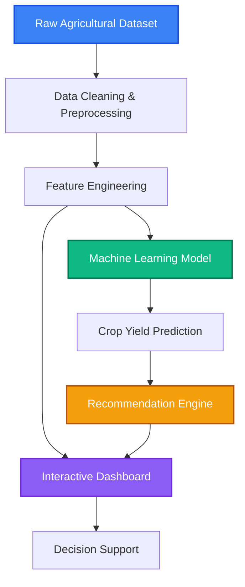

<h1 align="center">
  🌾 AgriIntel — Agricultural Intelligence & Decision Support System
</h1>

<p align="center">
  
  
  
  
  
  
</p>

---

## 🚀 Overview

**AgriIntel** is an Agricultural Intelligence & Decision Support System that combines data analytics, machine learning, and interactive visualization to transform agricultural data into actionable insights. The platform enables crop analysis, yield prediction, risk assessment, and intelligent farming recommendations through an interactive Streamlit dashboard.

---

## ✨ Key Features

### 📊 Agricultural Analytics
- Crop & State-wise Analysis
- Seasonal Performance
- Weather Impact Insights
- Interactive KPI Dashboard

### 🤖 Machine Learning
- Random Forest Regression
- Crop Yield Prediction
- Real-time Inference

### 🧠 Recommendation Engine
- Recommendations
- Risk Assessment
- Priority Classification

### 📈 Interactive Dashboard
- Multi-page Streamlit App
- Interactive Charts
- Dynamic Filters
- CSV/Excel Export

---

## 🌟 System Architecture



---

## 📂 Project Workflow

```text
Agricultural Dataset
        │
        ▼
Data Cleaning
        │
        ▼
Feature Engineering
        │
        ▼
EDA & Analytics
        │
        ▼
Machine Learning
        │
        ▼
Crop Yield Prediction
        │
        ▼
Recommendation Engine
        │
        ▼
Interactive Dashboard
```

---

## 📊 Dashboard Modules

| Module | Description |
|---------|-------------|
| 🏠 Home | Executive Dashboard |
| 🌾 Crop Explorer | Crop Analytics |
| 🏛 State Explorer | State Analytics |
| 📊 Analytics | Interactive Visualizations |
| 🤖 Prediction | Crop Yield Prediction |
| 🧠 Recommendation | Decision Support |
| 📂 Dataset Explorer | Dataset Browser |

---

## 📁 Project Structure

```text
AgriIntel/
├── app/
├── data/
├── models/
├── notebooks/
├── requirements.txt
├── LICENSE
└── README.md
```

---

## 🛠 Technology Stack

| Category | Technologies |
|----------|--------------|
| Language | Python |
| Data Analysis | Pandas, NumPy |
| Visualization | Plotly, Matplotlib, Seaborn |
| Machine Learning | Scikit-learn, Random Forest, Joblib |
| Dashboard | Streamlit |
| Tools | Jupyter Notebook, Git, GitHub |

---

## ⚙️ Installation

```bash
git clone https://github.com/yourusername/AgriIntel.git
cd AgriIntel

python -m venv venv

pip install -r requirements.txt
```

---

## 🚀 Run the Application

```bash
python -m streamlit run app/app.py
```

---

## 📂 Dataset

The original dataset is not included in this repository due to its size.

You can use your own agricultural dataset by placing it in the following directory:

```text
data/final/master_dataset_recommendation.csv
```

The dataset should contain the required features used throughout the project, such as:

- State
- District
- Crop
- Season
- Area
- Production
- Yield
- Weather Features
- Soil Features
- Predicted_Yield
- Recommendation
- Priority

After placing the dataset in the above location, the Streamlit application will work properly.

---

## 📸 Dashboard Preview

Add screenshots for:
- Home Dashboard
- Crop Explorer
- State Explorer
- Analytics
- Prediction
- Recommendation
- Dataset Explorer

---

## 🌟 Project Highlights

- End-to-End Data Science Pipeline
- Machine Learning Based Crop Yield Prediction
- Recommendation Engine
- Interactive Streamlit Dashboard
- Modular Project Structure
- Agricultural Decision Support System

---

## 🚀 Future Enhancements

- GIS-Based Interactive Maps
- Weather API Integration
- Time Series Forecasting
- Cloud Deployment

---

## 🤝 Contributing

Contributions are welcome! Feel free to fork the repository, create a feature branch, and submit a pull request.

---

## 📜 License

This project is licensed under the **MIT License**.

---

## 👨‍💻 Author

**Aryan Dhiman**

Computer Science Engineering Student

Passionate about Artificial Intelligence, Machine Learning, Data Science, and Full-Stack Development.

---

<div align="center">

### 🌾 AgriIntel

**AI-Powered Agricultural Intelligence & Decision Support System**

⭐ If you found this project helpful, consider giving it a star.

</div>
